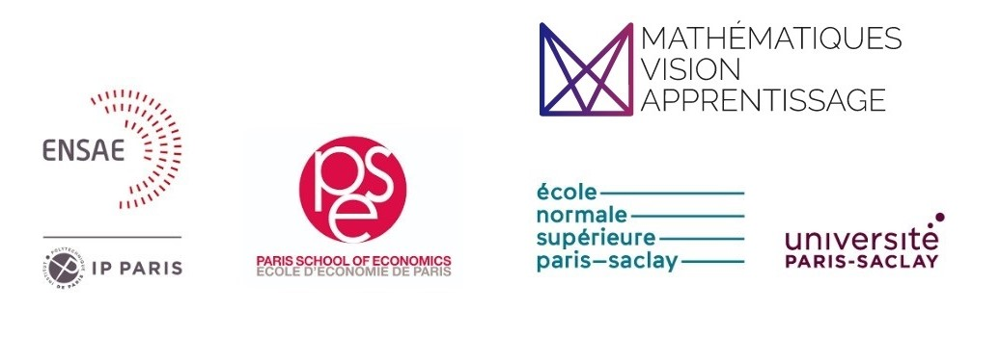

[![LinkedIn][linkedin-shield]][linkedin-url]

### 🎓 Curriculum Vitae

 

    

 

- **ENS Paris-Saclay** - Economie & Master MVA

- **ENSAE** - Cycle ingénieur - Data science, statistiques et apprentissage

- **PSE** - Master Analyse et Politique Economiques
 
### 📧 Contact

[Email](mailto:julien.peignon@ens-paris-saclay.fr) - [LinkedIn](https://linkedin.com/in/julien-peignon/)

[linkedin-shield]: https://img.shields.io/badge/-LinkedIn-black.svg?style=for-the-badge&logo=linkedin&colorB=555
[linkedin-url]: https://linkedin.com/in/julien-peignon/
